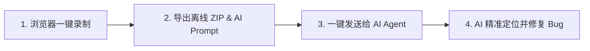

# Bug Lens 🤖

> **The Ultimate Context Provider for AI Code Assistants & Vibe Coders**
> 专为 AI Agent（Cursor, Claude Code, Antigravity 等）及 **Vibe Coding 创作者**打造的前端缺陷现场上下文捕获扩展。
> 
> 作为一个拥有 **5 年+ 经验的前端老炮**，深度体会过 AI 时代前端调试与沟通的痛点。Bug Lens 就是为了打通从“现场捕获”到“AI 精准修复”最后一公里而打造的专业工具。

---

## 💡 为什么需要 Bug Lens？

无论你是**资深开发者**还是 **Vibe Coding 玩家**（靠 AI 辅助完成开发的创作者），在让 AI 诊断和修复前端 Bug 时，常遇到**上下文缺失**的痛点：
- **看不见现场**：AI 无法感知你点击了哪个元素、触发了什么 DOM 变化与报错。
- **排错门槛高**：Vibe Coder 往往不懂如何使用 DevTools 抓包提取控制台与网络请求，传统开发者手动截图复制也极度繁琐。

**Bug Lens 是为 AI 时代打造的现场感知工具**：无需懂复杂代码调试，在浏览器端一键录制复现过程，自动提炼完整的缺陷现场（DOM 快照、点击轨迹、Console 日志、Network 报文及录屏），并生成可直接丢给 AI 的标准提示词与文件上下文！

---

## ⚡️ AI 原生工作流 (AI-Native Workflow)



1. **一键捕获**：点击扩展 Popup 开始录制，复现问题（自动记录点击红圈、DOM 快照、Console、Network 及 WebM 录屏）。
2. **生成报告**：导出静态 ZIP 压缩包，系统自动生成供 AI 理解结构的 `AI_PROMPT.md` 与动态 `README.md`。
3. **喂给 AI**：在预览页一键复制 Prompt 与本机绝对路径，直接发送给 AI 编程助手，AI 即可获取全量现场信息开展修复。

---

## 🌟 核心特性

- 🎯 **精准现场捕获**：高亮点击元素，捕获带有红色圆环轨迹的截图与原始干净截图。
- 📦 **零服务端·安全离线**：导出纯静态 ZIP 报告，内含离线 `report.html`，数据完全本地化。
- 🤖 **AI 深度整合**：
  - `AI_PROMPT.md`：自动生成指导 AI 逐层剖析报告资源的提示词模板。
  - **结构化上下文**：为 DOM 快照、控制台报错与网络请求提供结构化数据源。
- ⏱️ **时间线与非破坏性编辑**：支持按时间线联动查看日志与视频，导出前可排除敏感/无用数据。

---

## 🚀 下载与安装 (Installation)

### 方式一：直接下载 Releases 安装包（推荐）

1. 点击直接下载预编译插件包：[📥 bug-lens-v0.3.0.zip](https://github.com/Aoyia/bug-lens/releases/download/v0.3.0/bug-lens-v0.3.0.zip)（或前往 [Releases 页面](https://github.com/Aoyia/bug-lens/releases/latest)）。
2. 将下载的 ZIP 压缩包解压到本地任意目录。
3. 打开 Chrome 扩展管理页 `chrome://extensions/`，开启右上角 **“开发者模式”**。
4. 点击 **“加载已解压的扩展程序”**，选择刚刚解压的目录即可完成安装。

### 方式二：从源码构建

```bash
npm install
npm run build
```

构建完成后，在 `chrome://extensions/` 中选择加载本项目的 `dist/` 目录。

---

## 🛠️ 当前限制与规划

- **CDP Frame 映射**：iframe 点击保持交互记录，CDP Frame 几何映射完成前暂停绘制红圈。
- **Network 聚合**：包含基础请求/响应头及可读正文，重定向链与乱序 ExtraInfo 聚合持续完善中。
- **Console 序列化**：支持 CDP 结构摘要，完整对象序列化进行中。
- **导出机制**：当前采用内存内 ZIP 导出。

---

📄 详细需求文档与架构设计请参阅：
- [需求说明](file:///Users/zhijian/Documents/mvp/bug-lens/docs/01-requirements.md)
- [技术方案](file:///Users/zhijian/Documents/mvp/bug-lens/docs/02-technical-solution.md)
- [实施设计](file:///Users/zhijian/Documents/mvp/bug-lens/docs/03-implementation-design.md)

---

💬 **反馈与建议**：使用过程中遇到任何问题或有新功能想法，欢迎提交 [Issues](https://github.com/Aoyia/bug-lens/issues) 交流反馈！
