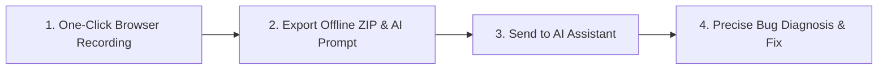

# Bug Lens

**English** | [中文文档](README_zh.md)

> **The Ultimate Context Provider for AI Code Assistants & Vibe Coders**
> A Chrome Extension designed for AI Agents (Cursor, Claude Code, Antigravity) and Vibe Coding creators to seamlessly capture full-stack bug context from frontend sessions.

---

## Why Bug Lens?

Whether you are a developer or a Vibe Coding creator (building software with AI assistance), asking AI to diagnose and fix frontend bugs often hits a wall due to **missing runtime context**:

- **Lack of Visual & Event Context**: AI cannot see which element you clicked, or what DOM mutations & errors occurred in real time.
- **High Debugging Threshold**: Non-technical vibe coders struggle to extract network payloads or console logs from browser DevTools, while traditional developers waste time manually taking screenshots and copying log traces.

**Bug Lens bridges the gap between bug occurrence and AI-powered resolution**: One-click recording in your browser captures complete bug context—DOM snapshots, click tracks with visual indicators, console logs, network HTTP request/response bodies, and WebM screen recordings—and automatically generates structured AI prompts and file bundles ready for instant AI ingestion.

---

## AI-Native Workflow



1. **One-Click Capture**: Click the extension popup to start recording and reproduce the issue (capturing red click rings, DOM snapshots, console logs, network traffic, and screen recording).
2. **Generate Report**: Export an offline ZIP archive containing `AI_PROMPT.md` and an interactive `report.html`.
3. **Feed to AI**: Copy the auto-generated prompt and local file paths directly into Cursor, Claude Code, or Antigravity for instant context ingestion.

---

## Key Features

### 1. Web Screenshot & AI Prompt Annotation

Capture screen areas, measure pixel dimensions, draw pointer arrows, and add bilingual notes to formulate precise visual bug reports and design modification prompts for AI assistants.


### 2. Comprehensive Context Capture & Safe Recording

One-click session recording with full control over DOM snapshots, console logs, network payloads, framework state, and localized data sanitization modes.


### 3. In-Page Compact Recording Widget

A non-intrusive floating widget docked at the edge of the web page during recording. Supports instant issue marking (`Option+S` / `Alt+S`), live timer display, and one-click silent export (`Stop & Export`).


### 4. Interactive Evidence Preview & Timeline Inspection

Inspect recorded sessions with video-timeline synchronization, sanitized network payloads, console error logs, and multi-track filtering before exporting.


- **Accurate Click & DOM Capture**: Automatically captures screenshots highlighting clicked elements with red visual rings alongside raw clean screenshots.
- **Zero Backend & Privacy-First**: Exports self-contained, offline ZIP packages. Data remains 100% local with redaction modes for sensitive tokens/headers.
- **Deep AI Integration**:
  - `AI_PROMPT.md`: Pre-formatted instructions guiding AI models to analyze evidence step-by-step.
  - **Automatic Clipboard Integration**: Automatically copies the generated AI Prompt to the system clipboard upon export completion (`onExportComplete`), notifying the user via a Toast message (`"ZIP 下载完成，AI 提示词已自动复制到剪贴板！"` / `"ZIP download complete, AI prompt automatically copied to clipboard!"`) for immediate pasting into Cursor / Claude Code.
  - **Structured Context**: Provides structured JSON representations for DOM snapshots, console errors, and network payloads.
- **Timeline Inspection & Filtering**: Interactively sync logs with video playback and exclude sensitive or redundant data before exporting.

---

## Installation

### Option 1: Direct Download (Recommended)

1. Download the pre-compiled package: [bug-lens-v0.6.0.zip](https://github.com/Aoyia/bug-lens/releases/download/v0.6.0/bug-lens-v0.6.0.zip) (or visit the [Releases Page](https://github.com/Aoyia/bug-lens/releases/latest)).
2. Unzip the downloaded ZIP file to any local folder.
3. Open `chrome://extensions/` in Google Chrome and enable **"Developer mode"** in the top right corner.
4. Click **"Load unpacked"** and select the unzipped directory.

### Option 2: Build from Source

```bash
pnpm install
pnpm run build
# Package into release zip
pnpm run package
```

After building, load the generated `dist/` directory in `chrome://extensions/`.

> **Publishing to Chrome Web Store**: Refer to [CHROMEWEBSTORE.md](CHROMEWEBSTORE.md) for full Store Listing text, permission justifications, and publishing checklist.

---

## Limitations & Roadmap

- **CDP Frame Mapping**: Tracks clicks across iframes; red indicator ring rendering will refine with frame coordinate mapping.
- **Network Aggregation**: Captures headers and readable text bodies; redirect chain and out-of-order ExtraInfo joining is continuously improved.
- **Console Object Serialization**: Supports CDP structured summaries, with full deep object serialization in progress.

---

## Feedback & Contributions

Have questions or feature requests? Feel free to open an [Issue](https://github.com/Aoyia/bug-lens/issues)!

---

## License

This project is licensed under the [GNU Affero General Public License v3.0](LICENSE) (AGPL-3.0). Any modification or derivative work must also be open-sourced under AGPL-3.0.
