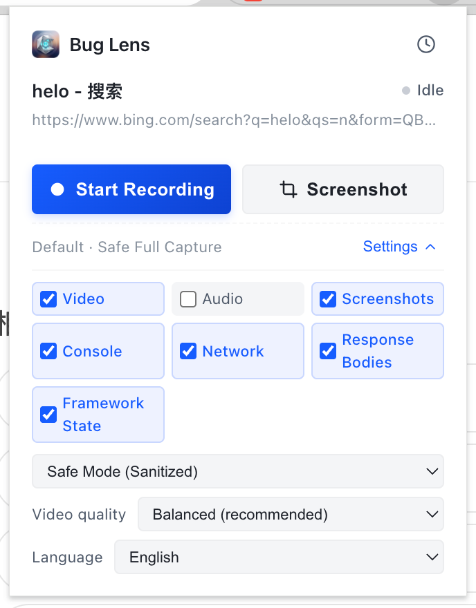
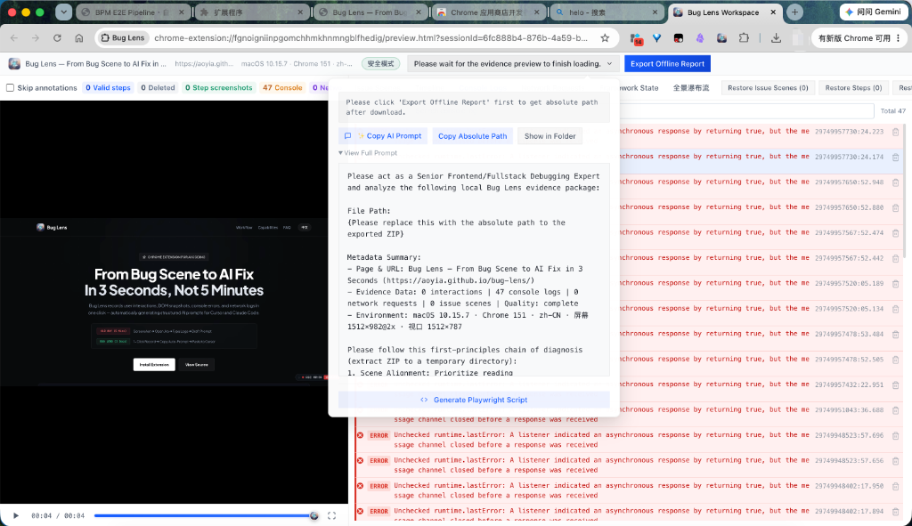
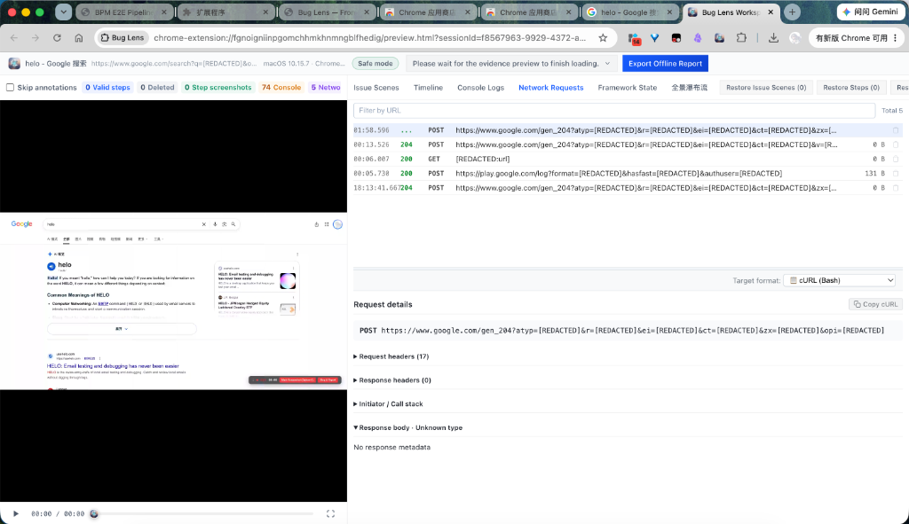
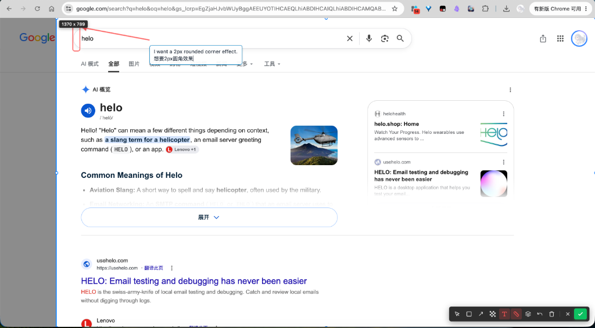

# Bug Lens

[English Version](README.md) | **中文文档**

> **AI 编程助手与 Vibe Coding 创作者的现场感知利器**  
> 一键捕获浏览器前端缺陷的完整运行时上下文（DOM 快照、点击轨迹红圈、Console 报错与网络报文），自动生成结构化 AI 提示词与离线证据包，让 AI 精准排障与修复。

---

## ⚡ 核心能力一览

### 1. 全量上下文配置与安全录制面板

一键开启录制，自由勾选视频、截图、控制台、网络请求/响应体以及前端框架状态，内置本地数据隐私脱敏模式。



### 2. 页面轻量吸附录制挂件

录制期间在网页边缘提供无干扰挂件，支持快捷标记缺陷现场（`Option+S` / `Alt+S`）、实时录制时长显示以及一键直出结束导出。



### 3. 交互式证据预览与时间线排查

录制完成后支持视频与时间线联动回放、控制台错误定位、网络请求正文解密与脱敏，以及导出前的非破坏性过滤。



### 4. 网页即时截图与 AI 提示词批注

无需录制时的独立截图工具，支持区域框选裁剪、像素尺寸测量、划线箭头指向与中英双语文字批注，直接向 AI 精准描述前端缺陷与修改诉求。



---

## 🚀 3 步极速上手

1. **安装插件**：下载预编译安装包 [bug-lens-v0.6.0.zip](https://github.com/Aoyia/bug-lens/releases/latest) 并解压，在 Chrome 扩展管理页（`chrome://extensions/` 开启开发者模式）点击 **“加载已解压的扩展程序”**。
2. **一键录制**：在目标网页点击插件图标或按 `Cmd/Ctrl+Shift+Y` 开始录制并复现问题。
3. **丢给 AI**：点击 **“结束并导出”**，Bug Lens 自动下载离线证据包并将生成的 AI 提示词写入剪贴板，直接粘贴到 Cursor、Claude Code 或 Antigravity 即可开启精准修复！

---

## 📦 从源码构建

```bash
pnpm install
pnpm run build
# 打包生成发布 ZIP 包
pnpm run package
```

---

## 📄 开源许可证

本项目采用 [GNU Affero General Public License v3.0 (AGPL-3.0)](LICENSE) 开源许可证。
